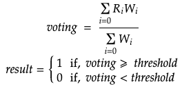

# IMAS-MADS

An IMAS project, design and implement by Team 2:

- Xiao Fei
- Lihong Ji
- Yanbin Zhu
- Shanshan Zhang
- Demokan Coban

## 1. Set the configure.xml

Before running the system, you can change the settings in the configure.xml. The configure file is located in the path “MADS/configure.xml”. In the configuration, there are following settings available to change.

|Configure         | Details |
|:-                | :- |
|path              | the path to the dataset|
|numberofclassifier| the number of classifier agent|
|numberofattributes| the number of attribute each classifier agent use to train, default is 6|
|numberoftrain     | the number of training data, default is 225|   
|numberofval       | the number of validation data, default is 75|
|numberoftest      | the number of test data, default is 50|
|numberofeval      | the number of evaluation data, default is 15|
|randomseed        | the seed for random generation|
|testattrs         | the attributes used for test and evaluation dataset. It is an integer, which binary represents the mask of which attribute is used. I.e 1011 means the first, third and fourth attributes are used.
|autotest          | whether to automatically test the data when the system is trained and ready to test. You can always test manually by sending the message “Test” to user1 agent.
|autostart         | whether to automatically start the system when running the system. If yes, the system will automatically prepare and train the classifier agent after running the system. If not, it requires manually start the system by sending the message “Start” to user1 agent.
|votingmessure     | choose which voting mechanism is used to compose the final prediction. Options are uniform(plurality voting), and weighted voting using different weights from validation result including TPR, FPR, Precision, Recall, FMeasure,  MatthewsCorrelation, Area under ROC, Area under PRC.
|votingthreshold   | the voting result is normalized in range [0,1], the final prediction result is determined by the voting threshold which 

## 2. Usage

### 1.Run configuration
   1. In Run->Edit configuration-> + for add new configuration -> Select Maven
   2. In Parameters-> Command Line -> add following:
      1. exec:java -f pom.xml
   3. In Parameters-> Profiles -> add following: 
      1. Test
   4. Run Test Configuration, the GUI Agent system will run.

#### If set the autostart to true, then skip step 2
### 2. After running the GUI Agent system, to start the agents:
   1. Select user1 agent on the left side window
   2. Right-click the user1 agent
   3. Select Send Message
   4. In the popup window, Select request in the Communicative dropdown menu
   5. Type "Start" in Content box
   6. Click 'Ok' to send message

#### If set the autotest to true, you can skip setp 3 or you can manually test the system by following step 3.
### 3. After system is prepared and trained, it is time to test:
   1. Select user1 agent on the left side window
   2. Right-click the user1 agent
   3. Select Send Message
   4. In the popup window, Select request in the Communicative dropdown menu
   5. Type "Test" in Content box
   6. Click 'Ok' to send message